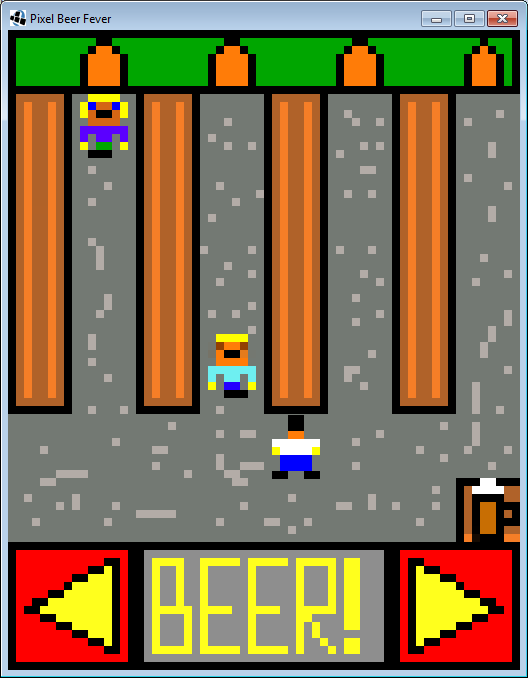

# Pixel Beer Fever

This is a little game, which was originally entry for #lowrezjam in 2016 - you can find it [here](https://itch.io/jam/lowrezjam2016/rate/62374).

## About game

It's a simple "Tapper" clone from arcade systems. You are a waiter, your task is to get a beer from a table and put it on proper beer "lane" for thirsty clients. If you break 3 beers or client reach you - you will get lost.

## Images

## Where can I get a build?

[Android version](https://www.dropbox.com/s/lkur1u1xyl5bl50/pixel-beer-fever.apk?dl=0)

## How to build

> ATTENTION: When you want to run desktop project in IntelliJ you have to set working directory to `android/assets`.

`./gradlew android:build` <== to generate Android .apk

`./gradlew build` <== to generate .jar for desktop - I used it for debugging

## About project development
After spending lot of time for doing other things I finally managed to finish it in my free time - yes, it tooks months because of my procrastination and other things.

Code is very strange - after jam I don't want to spend much time on this project, I know where are problems with that. However - you can fork it and make it awesome ;) .

Maybe this game will be on Google Play store - if not I think it could be some resource for learning basics of LibGDX game development.

## License
MIT
